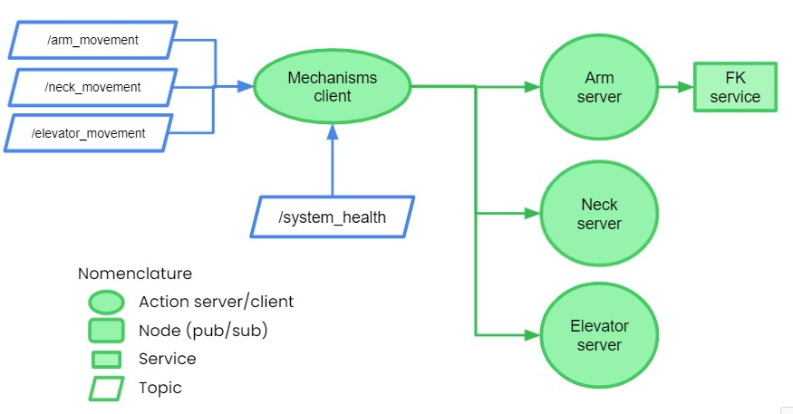
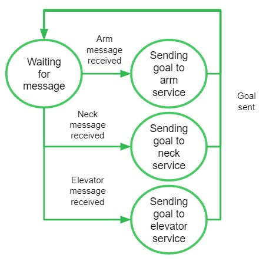
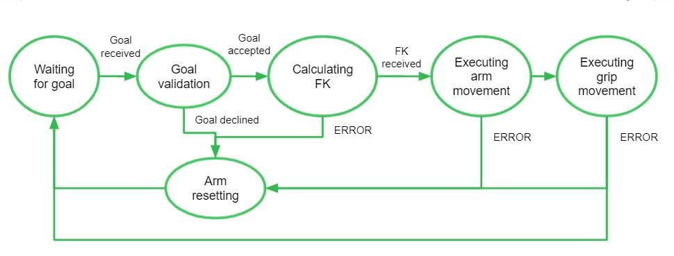
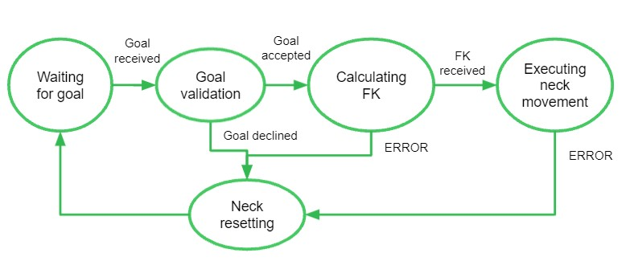
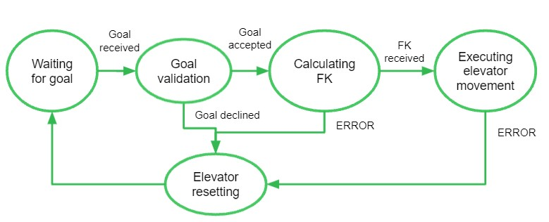

# System Integration Challenge
## Mechanism integration

## Description
Here is a technical description of the different nodes/actions/services the @HOME Robot Mechanisms will be required to have. As the integration programmer, your objective is to correctly implement it.

## Development team

| Name                    | Email                                                               | Github                                                       | Role      |
| ----------------------- | ------------------------------------------------------------------- | ------------------------------------------------------------ | --------- |
| Aurora Tijerina | [auro.tj@gmail.com](mailto:auro.tj@gmail.com) | [@AuroTB](https://github.com/aurotb) | Navigation & Integration |
| José Cisneros | [A01283070@itesm.mx](mailto:A01283070@itesm.mx) | [@Josecisneros001](https://github.com/Josecisneros001) | PM & Programmer |

## Table of contents

- [Mechanism integration](#mechanism-integration)
  - [Description](#description)
  - [Table of contents](#table-of-contents)
  - [Development team](#development-team)
  - [Env Setup](#env-setup)
  - [Installation](#installation)
  - [Usage](#usage)
  - [System Architecture](#system-architecture)
  - [Mechanism action client](#mechanism-action-client)
  - [Mechanism action client](#mechanism-action-client)
  - [Mechanism action servers](#mechanism-action-servers)

## Env setup
1. Install ROS Noetic : [Reference](http://wiki.ros.org/noetic/Installation/Ubuntu)

## Installation
1. **Fork the repository into your account**

2. Clone the project repository on your local machine.

   HTTP:

   ```bash
   $ git clone https://github.com/your-username/Candidates-2021.git
   ```

   SSH
   ```bash
   $ git clone git@github.com:your-username/robocup-home.git
   ```

3. Change to branch systemIntegrationChallenge

   bash
   $ git checkout systemIntegrationChallenge
   
## Usage
For evaluation and debugging of your 

## System Architecture

The system architecture will be constructed with a series of action servers as shown below:



## Mechanism action client
This node shall implement the action clients that will call the arm server, neck server and elevator server.

For now, because we need the mechanisms to be able to move asynchronously, take into account a system where three signals can arrive at any time to a listener node via topics. These topic are:

| Topic name | Message definition |
| --- | --- |
| /arm_movement | moveit_msgs/Grasp data |
| /neck_movement | geometry_msgs/Quaternion data|
| /elevator_movement | geometry_msgs/Pose data|

#### State machine:


### Shutdown system
The system health node will publish each second the state of the robot.

| Topic name | Message | Definition |
| --- | --- | --- |
| system_health | uint16 data | <ul><li>0 - System is stable</li><li>1 - System encountered an error</li></ul> |

When encountering a system error all action servers must shut down and mechanisms shouls be reseted. For now, this signal will be directy sent to the mechanism action client.

## Mechanism action servers

### Arm Server
This node shall implement the arm state machine, giving the corresponding feedback and result.

#### State machine:


#### Action server definition
| Goal message | Result | Feedback |
| --- | --- | --- |
| *moveit_msgs/Grasp grasp*: Specifies the final position and orientation of the TCP. | *uint16 result*: Defines the result of the action. <ul><li>0 - TCP correctly positioned</li><li>1 - Arm stuck</li><li>2 - Grip stuck</li><li>3 - Unknown error</li></ul> | *uint16 state*: Specifies the state of action in which the arm is currently. <ul><li>0 - Calculating FK</li><li>1 - Executing arm movement</li><li>2 - Executing grip movement</li></ul> |

### Neck Server
This node shall implement the neck state machine, giving the corresponding feedback and result.

#### State machine:


#### Action server definition
| Goal message | Result | Feedback |
| --- | --- | --- |
| *geometry_msgs/Quaternion posture*: Specifies the final orientation of the neck. | *uint16 result*: Defines the result of the action. <ul><li>0 - Neck correctly positioned.</li><li>1 - Neck stuck</li><li>2 - Unknown error</li></ul> | *uint16 state*: Specifies the state of action in which the neck is currently. <ul><li>0 - Calculating FK</li><li>1 - Executing neck movement</li></ul>|

### Elevator Server
This node shall implement the elevator state machine, giving the corresponding feedback and result.

#### State machine:


#### Action server definition
| Goal message | Result | Feedback |
| --- | --- | --- |
| *geometry_msgs/Pose pose*: Specifies the final position and orientation of the robot's torso. | *uint16 result*: Defines the result of the action. <ul><li>0 - Torso correctly positioned.</li><li>1 - Elevator mechanism stuck</li><li>2 - Unknown error</li></ul> | *uint16 state*: Specifies the state of action in which the elevator is currently. <ul><li>0 - Calculating FK</li><li>1 - Executing elevator movement</li></ul>|